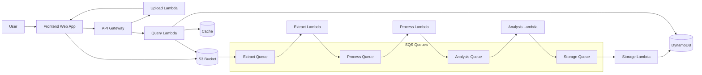

## Architecture Diagram

```mermaid
flowchart LR
  U[User]
  FE[Frontend Web App]
  APIGW[API Gateway]
  UL[Upload Lambda]
  QL[Query Lambda]
  S3[(S3 Bucket)]
  DDB[(DynamoDB)]
  CACHE[(Cache)]
  EL[Extract Lambda]
  PL[Process Lambda]
  AL[Analysis Lambda]
  SL[Storage Lambda]

  subgraph SQS["SQS Queues"]
    direction TB
    SQSE[Extract Queue]
    SQSP[Process Queue]
    SQSA[Analysis Queue]
    SQSS[Storage Queue]
  end

  U --> FE
  FE --> APIGW
  APIGW --> UL
  UL --> FE
  FE --> S3

  S3 --> SQSE
  SQSE --> EL
  EL --> SQSP
  SQSP --> PL
  PL --> SQSA
  SQSA --> AL
  AL --> SQSS
  SQSS --> SL
  SL --> DDB

  APIGW --> QL
  QL --> DDB
  QL --> CACHE
  QL --> S3
```
