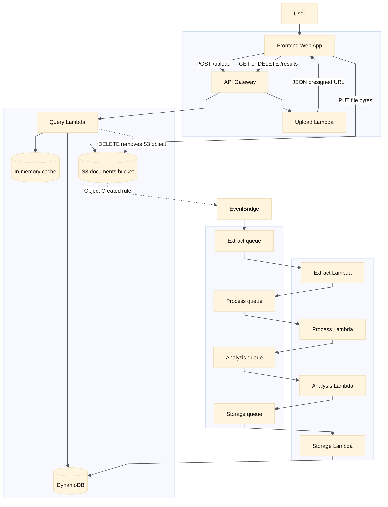

## Architecture Diagram

Uploads use **two hops**: the browser calls **API Gateway → Upload Lambda** only to get a **presigned URL**; the **file bytes never pass through** Upload Lambda or Query Lambda. The browser then **PUTs directly to S3**. Query Lambda is for **listing / detail / delete**, not for the presigned upload step.

